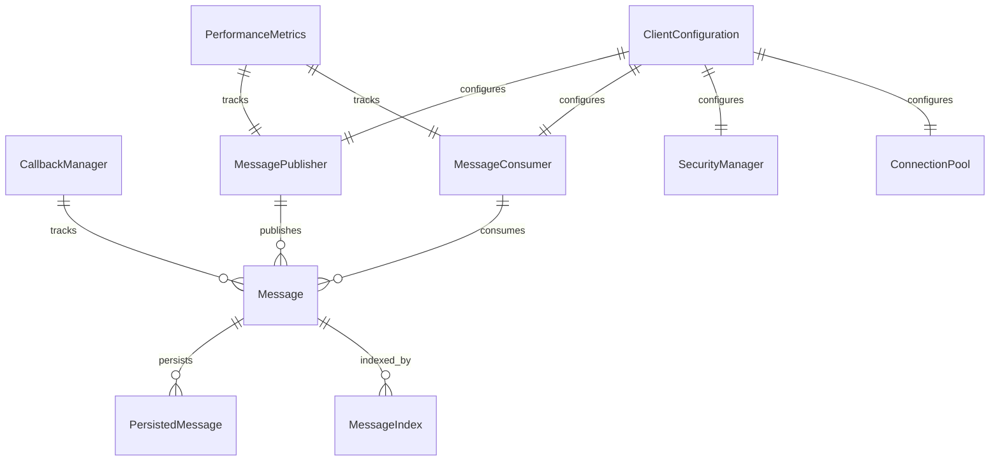

# Data Model: RocketMQ Async Client

**Feature**: RocketMQ Async Client
**Branch**: 001-rocketmq-client
**Date**: 2025-11-09

## Overview

This document defines the core data entities and relationships for the RocketMQ async client library, based on the functional requirements and research decisions. The data model supports FIFO ordering, at-least-once delivery guarantees, local persistence, and high-concurrency operations.

## Core Entities

### 1. Message

Represents the fundamental message entity with all required metadata for async communication.

**Fields**:
| Field | Type | Description | Constraints |
|-------|------|-------------|-------------|
| messageId | String | Unique message identifier (UUID) | Required, Immutable |
| topic | String | Target topic name | Required, Not empty |
| callbackTopic | String | Reply topic for request-response patterns | Optional |
| headers | Map<String, Object> | Message headers and metadata | Optional |
| payload | byte[] | Message content | Required, Max 4MB (configurable) |
| timestamp | Instant | Message creation time | Required |
| status | MessageStatus | Current processing status | Required |
| retryCount | int | Number of retry attempts | Non-negative, Default 0 |
| priority | MessagePriority | Message priority for ordering | Default NORMAL |
| tags | Set<String> | Message tags for filtering | Optional |

**Validation Rules**:
- `messageId` must be unique across all messages
- `topic` must conform to RocketMQ naming conventions
- `payload` size must be <= configured maximum (default 2MB)
- `callbackTopic` required for request-response patterns

**State Transitions**:
```
PENDING -> PROCESSING -> COMMITTED
    \           \           \
     \           \-> FAILED -> RETRY -> PROCESSING
      \                              \
       \-> TIMEOUT -> FAILED
```

---

### 2. MessageStatus

Enumeration representing message processing states.

**Values**:
| Value | Description |
|-------|-------------|
| PENDING | awaiting processing |
| PROCESSING | currently being handled |
| COMMITTED | successfully processed |
| FAILED | processing failed |
| TIMEOUT | processing timed out |
| RETRY | scheduled for retry |

---

### 3. MessagePriority

Enumeration for priority-based processing.

**Values**:
| Value | Description | Processing Order |
|-------|-------------|-----------------|
| LOW | Low priority | Last |
| NORMAL | Normal priority | Middle |
| HIGH | High priority | First |
| CRITICAL | Critical priority | First in queue |

---

### 4. MessagePublisher

Entity responsible for async message publishing with retry logic.

**Fields**:
| Field | Type | Description |
|-------|------|-------------|
| producerId | String | Unique producer identifier |
| producerGroup | String | RocketMQ producer group name |
| maxRetries | int | Maximum retry attempts |
| retryInterval | Duration | Delay between retries |
| sendTimeout | Duration | Send operation timeout |
| compressionEnabled | boolean | Enable message compression |
| tlsEnabled | boolean | Enable TLS encryption |

**Operations**:
- `sendMessageAsync(message)`: Async message publishing
- `sendMessageSync(message)`: Synchronous publishing with timeout
- `batchSend(messages)`: Batch message publishing
- `getMetrics()`: Performance and health metrics

---

### 5. MessageConsumer

Entity for consuming messages with callback support.

**Fields**:
| Field | Type | Description |
|-------|------|-------------|
| consumerId | String | Unique consumer identifier |
| consumerGroup | String | RocketMQ consumer group |
| subscribedTopics | Set<String> | Topics being consumed |
| maxConsumeThreads | int | Maximum concurrent processing threads |
| orderedProcessing | boolean | Enable FIFO ordering |
| callbackHandlers | Map<String, MessageCallback> | Topic-specific handlers |

**Operations**:
- `start()`: Begin message consumption
- `stop()`: Stop message consumption
- `subscribe(topic, callback)`: Subscribe to topic with handler
- `unsubscribe(topic)`: Unsubscribe from topic
- `pause()`: Temporarily pause consumption
- `resume()`: Resume paused consumption

---

### 6. CallbackManager

Manages request-response correlation and timeout handling.

**Fields**:
| Field | Type | Description |
|-------|------|-------------|
| correlationMap | ConcurrentHashMap<String, CompletableFuture> | Pending requests mapping |
| defaultTimeout | Duration | Default response timeout |
| timeoutExecutor | ScheduledExecutorService | Timeout handling |
| callbackTopicResolver | Function<String, String> | Resolves callback topics |

**Operations**:
- `sendWithCallback(message, timeout)`: Send expecting response
- `handleRequestResponse(response)`: Handle incoming response
- `cancelPending(requestId)`: Cancel pending request
- `getPendingCount()`: Number of pending requests

---

### 7. ConnectionPool

Manages TLS-encrypted RocketMQ broker connections.

**Fields**:
| Field | Type | Description |
|-------|------|-------------|
| poolSize | int | Maximum connections |
| activeConnections | AtomicInteger | Currently active connections |
| maxIdleTime | Duration | Maximum idle connection time |
| healthCheckInterval | Duration | Connection health check frequency |
| tlsContext | SSLContext | TLS configuration context |

**Operations**:
- `getConnection()`: Acquire connection from pool
- `releaseConnection(connection)`: Return connection to pool
- `healthCheck()`: Validate connection health
- `closeAll()`: Close all connections

---

### 8. SecurityManager

Handles authentication and TLS certificate validation.

**Fields**:
| Field | Type | Description |
|-------|------|-------------|
| accessKey | String | RocketMQ access key |
| secretKey | String | RocketMQ secret key |
| tlsEnabled | boolean | TLS encryption enabled |
| certificatePath | String | Path to TLS certificate |
| trustStorePath | String | Path to trust store |

**Operations**:
- `authenticate()`: Authenticate with broker
- `validateCertificate()`: Validate TLS certificate
- `rotateCredentials()`: Rotate authentication credentials
- `getSecurityStatus()`: Current security status

---

## Persistence Layer

### 9. PersistedMessage

Entity for local persistence stores.

**Fields**:
| Field | Type | Description |
|-------|------|-------------|
| message | Message | Original message entity |
| persistedAt | Instant | When message was persisted |
| persistedTo | String | Storage location/path |
| checksum | String | Data integrity checksum |
| compressed | boolean | Whether data is compressed |

### 10. MessageIndex

Index entity for efficient message retrieval.

**Fields**:
| Field | Type | Description |
|-------|------|-------------|
| messageId | String | Reference to message |
| topic | String | Topic index key |
| status | MessageStatus | Status index key |
| timestamp | Instant | Time-based index |
| callbackTopic | String | Response topic (if applicable) |

---

## Configuration Entities

### 11. ClientConfiguration

Main configuration entity for the async client.

**Fields**:
| Field | Type | Description | Default |
|-------|------|-------------|---------|
| namesrvAddr | String | NameServer addresses | Required |
| producerGroup | String | Producer group name | auto-generated |
| consumerGroup | String | Consumer group name | auto-generated |
| maxMessageSize | int | Maximum message size | 2*1024*1024 |
| sendTimeout | Duration | Send operation timeout | 3 seconds |
| requestTimeout | Duration | Request-response timeout | 5 seconds |
| retryTimes | int | Retry attempts count | 3 |
| tlsEnabled | boolean | Enable TLS | false |
| compressionEnabled | boolean | Enable compression | true |
| persistenceEnabled | boolean | Enable local persistence | true |
| maxConnections | int | Connection pool size | 32 |

### 12. PerformanceMetrics

Metrics collection entity.

**Fields**:
| Field | Type | Description |
|-------|------|-------------|
| messagesSent | AtomicLong | Total messages sent |
| messagesReceived | AtomicLong | Total messages received |
| averageLatency | Double | Average processing latency |
| activeConnections | AtomicInteger | Current active connections |
| errorRate | Double | Current error rate percentage |
| memoryUsage | Long | Current memory usage in bytes |
| throughput | Double | Messages per second |

---

## Entity Relationships



## Data Flow Patterns

### 1. Message Publishing Flow
1. Application creates `Message` entity
2. `MessagePublisher` validates message
3. If persistence enabled, store in `PersistedMessage`
4. Send to RocketMQ broker via `ConnectionPool`
5. Update `PerformanceMetrics`
6. Handle response/update message status

### 2. Message Consumption Flow
1. `MessageConsumer` receives from RocketMQ
2. Lookup appropriate `MessageCallback`
3. Execute callback processing
4. If callback topic specified, send response
5. Update message status and metrics
6. Clean up completed messages

### 3. Request-Response Flow
1. Send message with callback topic
2. `CallbackManager` tracks correlation ID
3. Set timeout via `ScheduledExecutorService`
4. Process response or handle timeout
5. Complete `CompletableFuture` with result

## Validation Constraints

### Business Rules
- All messages必须有唯一ID
- 消息大小不能超过配置的最大值
- 回调主题必须有效且可访问
- 连接池大小必须支持并发操作
- 认证凭据必须有效且未过期

### Technical Constraints
- Memory usage < 100MB total
- Connection timeout < 30 seconds
- Message processing < 50ms P95 latency
- Support > 1000 concurrent operations
- FIFO ordering per topic

## Data Access Patterns

### High-Performance Considerations
- 使用 `ConcurrentHashMap` for thread-safe access
- Cache frequently accessed messages in memory
- Batch database operations for persistence
- Use connection pooling for database access
- Implement read/write分离for metadata and message data

### Consistency Guarantees
- **At-least-once delivery**: Messages persisted locally before send
- **FIFO ordering**: Message sequence numbers per topic
- **Exactly-once processing**: Idempotent message handling
- **Eventual consistency**: Distributed state synchronization

---

**Next Steps**: Use this data model to generate API contracts and implement the core classes in Phase 2 development.